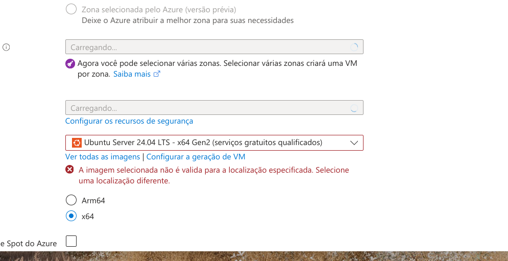
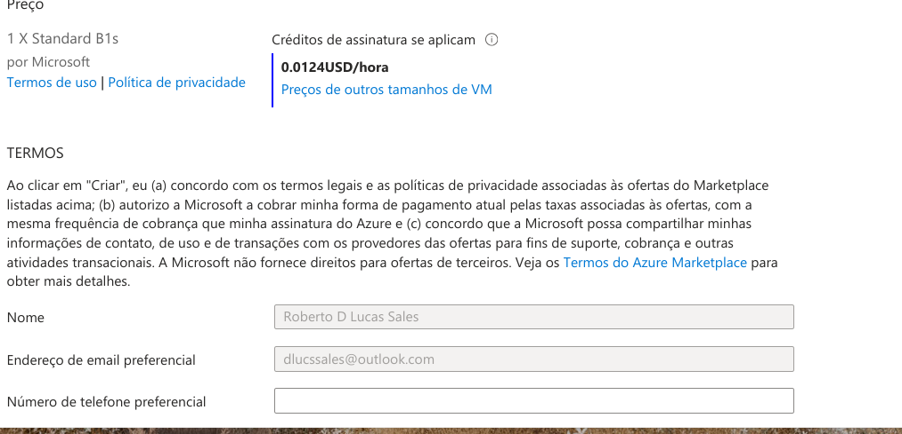

# Configurando Recursose Dimensionamentos em M-quinasVirtuaisnaAzure
Neste modulo podemos ver na pratica a criação de uma maquina virtual. 
Configurando de forma consciente e guiada pela professora, explicando detalhadamente cada funções de suas apliacações praticas.

